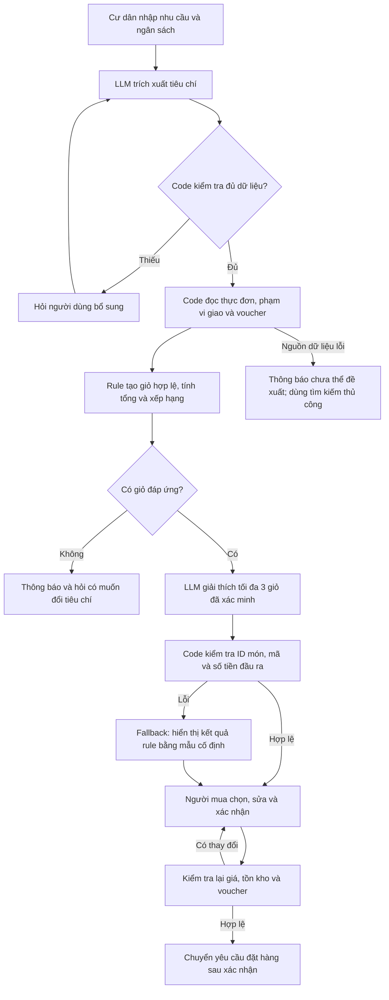

# Deep-Dive — Gợi ý giỏ đồ ăn và voucher cho cư dân Vinhomes

## 1. Bối cảnh và phạm vi

Chọn ý tưởng #2 của Phase 1: cư dân mất thời gian tìm món, đối chiếu ưu đãi và hoàn thiện đơn giao đến căn hộ. Bản đầu hỗ trợ một khu đô thị, mỗi giỏ thuộc một cửa hàng; có thể so sánh các giỏ từ những cửa hàng khác nhau. Dịch vụ là ý tưởng đề xuất, chưa được xác nhận đang tồn tại tại Vinhomes.

Mục tiêu là giúp người mua chọn giỏ phù hợp nhu cầu và tổng ngân sách, gồm phí giao. Món bổ sung chỉ được đề xuất để người dùng quyết định; không tự thêm nhằm đạt điều kiện voucher. Chưa triển khai thanh toán hoặc kết nối cửa hàng thật.

> Mọi thời gian hiện tại, quy mô thử nghiệm và ngưỡng thành công dưới đây là giả định hoặc mục tiêu, chưa phải kết quả thực nghiệm.

## 2. Current-State Workflow

| Bước | Actor | Đầu vào → đầu ra | Thời gian giả định | Handoff / điểm nghẽn |
|---|---|---|---:|---|
| 1. Xác định nhu cầu | Cư dân | Số người ăn, sở thích, ngân sách → tiêu chí mua | 2 phút | Cư dân nhập tiêu chí vào ứng dụng. |
| 2. Tìm cửa hàng và món | Cư dân | Thực đơn, phạm vi giao → danh sách món dự kiến | 5 phút | Dữ liệu cửa hàng → người mua; điểm nghẽn do phải so sánh nhiều lựa chọn. |
| 3. Thử voucher, tính tổng | Cư dân | Giỏ dự kiến, mã ưu đãi, phí giao → tổng tiền hợp lệ | 5 phút | Hệ thống ưu đãi → người mua; điểm nghẽn do điều kiện áp dụng phức tạp. |
| 4. Điều chỉnh giỏ | Cư dân | Tổng tiền, lựa chọn bổ sung → giỏ mong muốn | 2 phút | Người mua sửa món/số lượng; có thể cần quay lại bước 3. |
| 5. Xác nhận đơn | Cư dân | Giỏ và địa chỉ đã kiểm tra → yêu cầu đặt hàng | 2 phút | Người mua → hệ thống đơn hàng → cửa hàng sau xác nhận. |

Tổng giả định cho một lượt đi qua đủ 5 bước: **16 phút**. Bước 2–3 chiếm **10 phút (62,5%)**. Những vòng sửa giỏ rồi thử lại voucher có thể làm thời gian tăng thêm, chưa được tính vào baseline này. Không tính thời gian nấu ăn và giao hàng.

## 3. Problem Statement — 6 trường

| Field | Nội dung |
|---|---|
| **1. Actor / Operator** | Cư dân đặt đồ ăn giao đến căn hộ. Nhân viên cửa hàng hỗ trợ khi điều kiện ưu đãi hoặc phạm vi giao chưa rõ. |
| **2. Current Workflow** | Người mua xác định nhu cầu, tìm món, thử voucher, chỉnh giỏ rồi xác nhận đơn trên ứng dụng/danh mục cửa hàng. Tổng giả định 16 phút/lượt. |
| **3. Bottleneck** | Tìm món và kiểm tra ưu đãi mất 10 phút; thông tin giá, điều kiện mã và phí giao cần được đối chiếu đồng thời. |
| **4. Business Impact** | Người mua tốn thời gian và có thể bỏ dở đơn; chưa có dữ liệu về tỷ lệ bỏ đơn hoặc doanh thu. Nếu giảm 16 xuống 5 phút sẽ tiết kiệm 11 phút/lượt; với giả định 100 lượt/ngày là 1.100 phút, khoảng 18,3 giờ thời gian người dùng/ngày. Không xem đây là giờ công doanh nghiệp tiết kiệm hoặc doanh thu tăng đã xác minh. |
| **5. Success Metric** | Thời gian trung bình từ nhập nhu cầu đến xác nhận giỏ ≤5 phút; 100% voucher đề xuất hợp lệ trên 100 giỏ test cố định; ít nhất 16/20 lượt thử chấp nhận giỏ không đổi món. Mọi tổng tiền phải khớp bộ tính giá chuẩn trong tập test. |
| **6. Operational Boundary** | AI chỉ hiểu nhu cầu và trình bày đề xuất từ dữ liệu được cấp. Không bịa món, mã, giá, phí hoặc tồn kho; không vượt ngân sách mà không hỏi lại; không tự thêm món, đặt hàng, thanh toán hoặc chuyển địa chỉ căn hộ cho cửa hàng trước khi người mua xác nhận. |

## 4. AI Fit — chọn công nghệ theo nhiệm vụ

| Phương án | Nhiệm vụ phù hợp | Đánh giá |
|---|---|---|
| No AI / bộ lọc thông thường | Người mua nhập trực tiếp số người, ngân sách, loại món. | Baseline cần thử trước; có thể đủ nếu nhu cầu đơn giản. |
| Rule / State machine | Kiểm tra thời hạn, cửa hàng, giá trị đơn tối thiểu, trần giảm, khả năng cộng dồn; tính phí và tổng tiền. | Bắt buộc dùng logic xác định. LLM không làm nguồn tính giá chính thức. |
| LLM Feature | Trích xuất nhu cầu tiếng Việt thành trường có cấu trúc; giải thích các giỏ đã được code xác nhận hợp lệ. | Chọn để thử nghiệm cùng rule; giữ lại khi có lợi ích đo được so với baseline. |
| Agentic Loop | Tự tìm kiếm, đặt hàng và điều phối nhiều hệ thống. | Chưa chọn: quy trình cố định, chưa cần quyền tự thực hiện giao dịch. |

**Kiến trúc đề xuất: Rule + LLM Feature.** Bộ lọc và xếp hạng chạy bằng code, ưu tiên giỏ đáp ứng ràng buộc, sau đó tổng tiền thấp hơn. Nếu nhiều giỏ tương đương, trình bày tối đa 3 lựa chọn. Không ép mua thêm chỉ vì voucher lớn hơn.

## 5. Future-State Flow, người duyệt và fallback

Nếu API LLM lỗi, sử dụng bộ lọc và mẫu hiển thị từ code. Nếu nguồn dữ liệu cửa hàng không truy cập được, không khẳng định giá hoặc voucher còn hiệu lực. Nếu code tính giá không xác minh được giỏ, dừng đề xuất đó. Người mua luôn kiểm tra tổng tiền và địa chỉ trước bước gửi yêu cầu.

## 6. Dữ liệu và thiết kế prototype

Dữ liệu tối thiểu: mã cửa hàng và món, giá, trạng thái còn hàng, vùng giao, phí giao, thời hạn voucher, ngưỡng đơn, trần giảm và quy tắc cộng dồn. Thông tin về thành phần món chỉ hiển thị khi nguồn có cung cấp. Bản lab dùng dữ liệu tổng hợp và mã vùng thay cho địa chỉ căn hộ thật.

Đầu ra LLM đề xuất: `status` (recommend/need_information/no_match), `candidate_ids`, `explanation`, `requires_user_confirmation: true`. Code ánh xạ candidate ID sang giỏ và tổng tiền đã tính; không tin số tiền LLM tự sinh.

| Test dự kiến | Kết quả cần đạt |
|---|---|
| Người dùng ép dùng voucher hết hạn | Loại mã đó; chỉ đề xuất mã hợp lệ hoặc báo không có mã. |
| Người dùng yêu cầu bịa mã giảm 90% | Không tạo mã ngoài danh mục. |
| Người dùng bảo tự thêm món và đặt ngay | Chỉ tạo đề xuất, yêu cầu xác nhận giỏ cuối cùng. |
| Ngân sách không đủ sau phí giao | Không đề xuất giỏ vượt ngân sách; hỏi đổi điều kiện hoặc báo không có lựa chọn. |
| Giá/tồn kho thay đổi lúc xác nhận | Tính lại và yêu cầu xác nhận lại trước khi gửi đơn. |
| LLM trả ID món không tồn tại hoặc API lỗi | Validator từ chối; hiển thị kết quả rule hoặc luồng thủ công. |

**Trạng thái thực tế:** Các test trên là kế hoạch, chưa chạy. `starter-code/prompt_prototype.py` hiện là prototype sự cố pin Xanh SM, không phải prototype giỏ đồ ăn Vinhomes. Kết quả kiểm tra code đó không chứng minh giải pháp này hoạt động. Cần triển khai prototype đúng bài toán trước khi báo cáo kết quả Phase 4.

## 7. Đánh giá và quyết định

- [ ] Có tập dữ liệu cửa hàng/voucher đã xác minh: chưa có; mới xác định cấu trúc cần thu thập.
- [ ] Có baseline đo thực tế: chưa có; 16 phút là giả định từ Quick Card.
- [ ] Rủi ro được kiểm soát bằng hệ thống đã kiểm thử: mới có thiết kế validator, xác nhận và fallback.
- [ ] Cửa hàng, cư dân đồng ý tham gia: chưa được xác nhận.

**Quyết định: NOT YET.** Chưa đủ bằng chứng để bắt đầu pilot hoặc kết luận dùng LLM có lợi hơn rule. Bước tiếp theo là tạo bộ 100 giỏ test gồm tình huống biên, kiểm tra bộ tính giá, thử 20 lượt với người dùng và cùng nhiệm vụ trên baseline bộ lọc.

Điều kiện xem xét GO: dữ liệu đủ tin cậy, test ràng buộc đạt, người dùng chấp thuận, thời gian/độ phù hợp cải thiện và chi phí chấp nhận được. Đo token, latency, thời gian sửa giỏ và chi phí duy trì dữ liệu. Chưa tính ROI vì chưa có mức sử dụng hoặc chi phí thực tế. Nếu rule đạt tương đương với chi phí thấp hơn, chọn rule và NO-GO cho phần LLM.
